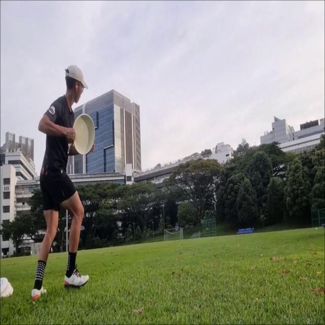
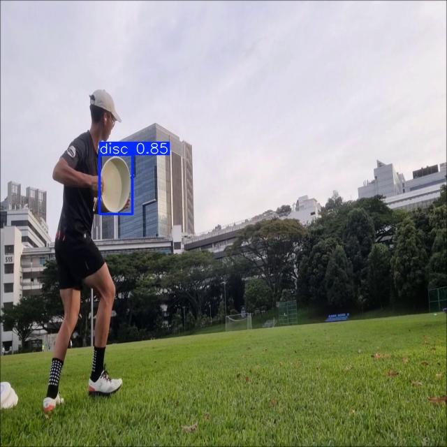

# Ultimate frisbee tracker

A computer vision project that aim to train a YOLO based CV model to track flying disc and hopefully deploy for real-time tracking applications



## Installation

1. Clone the repo:
   ```bash
   git clone https://github.com/awpbash/Flying_plate_tracker.git
   cd Flying_plate_tracker

2. Create and activate a virtual environment:
    ```bash
    python -m venv venv
    # macOS/Linux
    source venv/bin/activate
    # Windows
    venv\Scripts\activate
    ```
    OR
    ```bash
    conda create -n my_env python=3.11
    conda activate my_env
    ```

3.  Installing dependancies
    ```bash
    pip install -r requirements.txt
    ```

4.  Training and testing
    ```bash
    ##TBC
    ```

## Preliminary results

Below is an example of how the Flying Plate Tracker performs on a real-world frame. The Original image is shown alongside the Prediction, where the YOLO model has localized the flying disc and drawn a bounding box

<table>
  <tr>
    <th>Original</th>
    <th>Prediction</th>
  </tr>
  <tr>
    <td></td>
    <td></td>
  </tr>
</table>

### Frame by frame tracking

